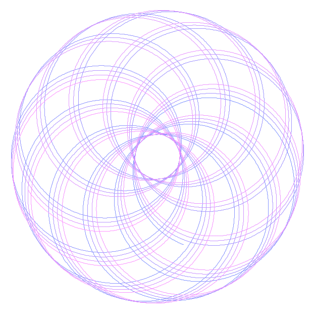

# Spirograph Simulation

This Spirograph simulation allows you to create beautiful and intricate geometric patterns with ease. The program was created with the assistance of ChatGPT, a powerful language model developed by OpenAI.



## Features

- Dynamic Spirograph patterns.
- Randomization of `R1`, `R2`, `d`, and `theta` values.
- Interactive controls (use the space bar to generate new patterns).

## Prerequisites

Before you can run this Spirograph simulation, you'll need to have [Processing](https://processing.org/) installed on your computer.

## Installation

1. **Install Processing**:
   - Download Processing from the [official website](https://processing.org/download/).
   - Follow the installation instructions for your operating system.

2. **Clone or Download this Repository**:
   - Clone this repository using Git:
     ```
     git clone https://github.com/everettwilson/Processing_Spirograph.git
     ```
   - Alternatively, you can download the ZIP file and extract it to your desired location.

## Usage

1. **Open the Project**:
   - Launch Processing.
   - Click on `File > Open...` and navigate to the directory where you cloned or extracted the repository.
   - Select the main sketch file (e.g., `gpt_spirograph.pde`) and click "Open."

2. **Run the Simulation**:
   - With the sketch open in Processing, click the "Run" button (a triangle icon) to start the simulation.
   - Use the space bar to generate new Spirograph patterns with random parameters.

3. **Interact with the Simulation**:
   - Experiment with different values for `R1`, `R2`, `d`, and `theta` to create unique patterns.
   - Press the space bar to generate new Spirograph patters with random parameters. 

## Credits

This Spirograph simulation was created with the help of ChatGPT, an AI language model developed by OpenAI.

## License

This project is open-source and available under the [MIT License](LICENSE).

